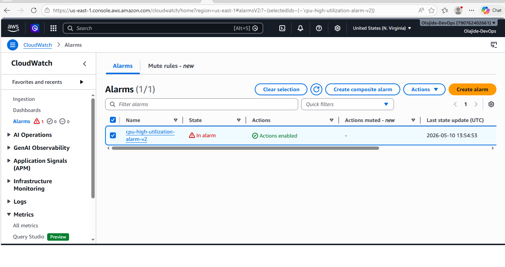
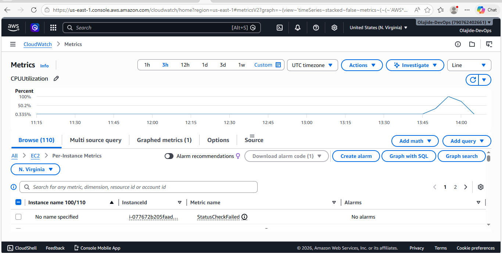
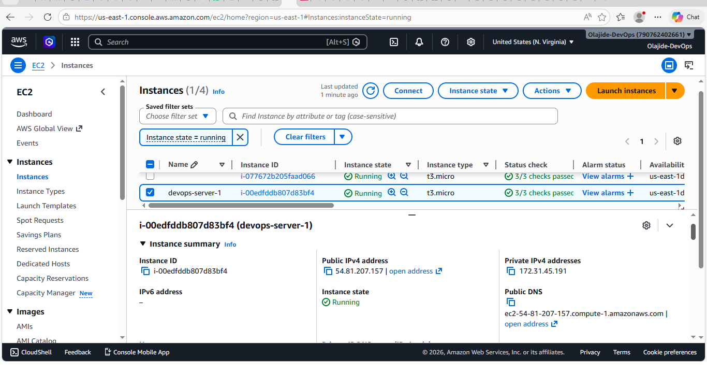
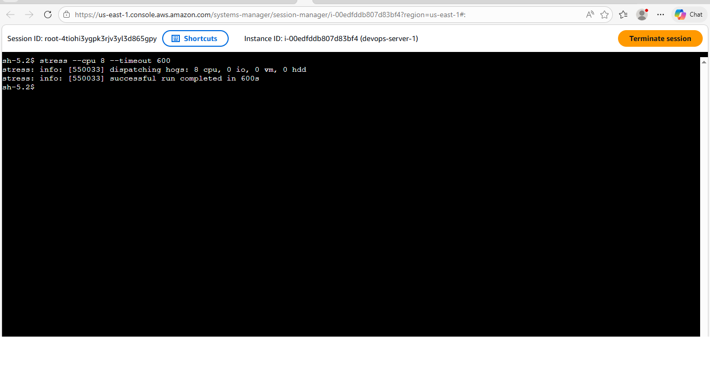
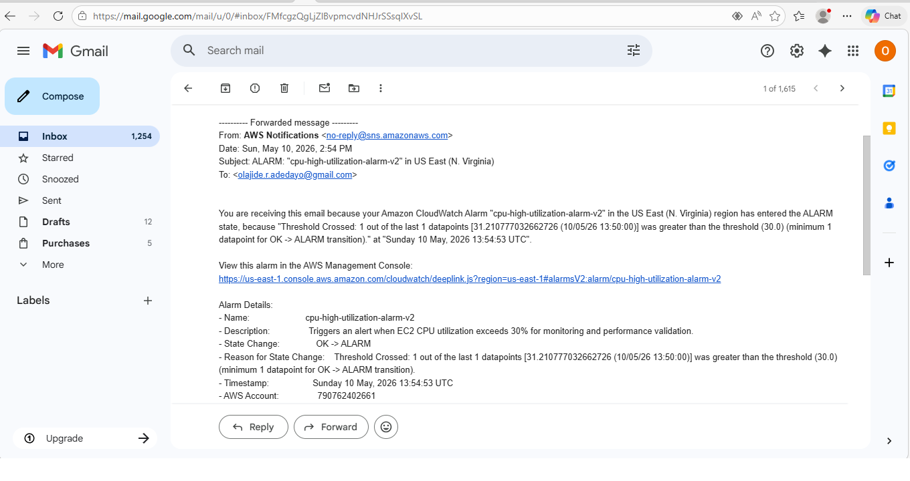

# AWS ALB + Auto Scaling Group (ASG) Project

## 📌 Project Overview

This project demonstrates the design and deployment of a highly available and scalable web infrastructure on AWS using Application Load Balancer (ALB) and Auto Scaling Group (ASG).

It simulates a real-world production environment where traffic is distributed across multiple servers, and new instances are automatically launched based on demand.

---

## 🧠 Architecture

```text
User
  ↓
Application Load Balancer (ALB)
  ↓
Target Group
  ↓
EC2 Instances (Apache Web Servers)
  ↓
Auto Scaling Group (ASG)

##   AWS Services Used

Amazon EC2 (Elastic Compute Cloud)
Application Load Balancer (ALB)
Target Groups
Auto Scaling Group (ASG)
Launch Template
Security Groups
Elastic Load Balancing Health Checks
Apache HTTP Server

##  Project Implementation

###  1. EC2 Instance Setup
Launched multiple EC2 instances
Installed Apache HTTP Server
Configured simple web pages for identification (Server 1 & Server 2)

###  2. Application Load Balancer (ALB)
Created ALB to distribute incoming traffic
Configured listener on HTTP port 80
Linked ALB to target group

###  3. Target Group Configuration
Registered EC2 instances as targets
Configured health checks using HTTP (port 80)
Verified all instances as healthy and serving traffic

###  4. Auto Scaling Group (ASG)
Created Launch Template for EC2 configuration
Configured Auto Scaling Group
Enabled ELB health checks
Set minimum, desired, and maximum capacity
Automatically launched additional EC2 instances when needed

##  ✅ Validation & Testing
Verified ALB DNS endpoint in browser
Confirmed traffic distribution across multiple EC2 instances
Observed switching between:
Server 1 (EC2 Instance)
Server 2 (EC2 Instance)
Auto Scaling instances
Confirmed all targets in Target Group were healthy
Validated Auto Scaling functionality

## 📸 Screenshots

### ALB Working in Browser


---

### Server 1 (EC2 Instance)


---

### Server 2 (EC2 Instance)


---

### Target Group Health Status


##  🎯 Key Outcomes
Built a highly available AWS architecture
Implemented load balancing across multiple EC2 instances
Configured automatic scaling based on demand
Gained hands-on experience with AWS networking and compute services
Understood health checks and fault tolerance mechanisms


##  📚 Skills Demonstrated
AWS EC2
Application Load Balancer (ALB)
Auto Scaling Group (ASG)
Target Groups & Health Checks
AWS Security Groups
Apache Web Server Deployment
Cloud Architecture Design
High Availability Systems

## 🚀 CloudWatch CPU Monitoring & Alarm Project

# AWS EC2 CPU Monitoring with CloudWatch & SNS Notifications

## 📌 Project Overview

This project demonstrates a real-world AWS monitoring and alerting solution using Amazon CloudWatch and SNS. The system monitors EC2 CPU utilization and triggers automated alerts when a defined threshold is exceeded.

The goal is to simulate a production-grade observability setup commonly used in DevOps and Cloud Operations environments.

---

## 🏗️ AWS Architecture

*Workflow:*

EC2 Instance → CPU Utilization Metric → CloudWatch Alarm → SNS Notification → Email Alert

---

## ☁️ AWS Services Used

- Amazon EC2 (Virtual Server)
- Amazon CloudWatch (Monitoring & Metrics)
- Amazon CloudWatch Alarms
- Amazon SNS (Simple Notification Service)
- IAM (Identity and Access Management)
- AWS Systems Manager (Session Manager)

---

## ⚙️ Implementation Steps

### 1. EC2 Instance Setup
- Launched an EC2 instance named devops-server-1
- Configured IAM role with Systems Manager permissions
- Enabled Session Manager access

---

### 2. CPU Load Simulation
- Installed stress testing tool on EC2:
```bash
sudo yum install stress -y

### Simulated CPU load:
stress --cpu 8 --timeout 600

### 3. CloudWatch Metrics Configuration
- Navigated to CloudWatch Metrics
- Selected:
  - EC2 → Per-Instance Metrics
  - CPUUtilization for instance ID

---

### 4. CloudWatch Alarm Setup
- Created alarm based on CPUUtilization metric
- Conditions:
  - Threshold: CPU > 30%
  - Period: 1 minute
  - Evaluation: 1 out of 1 datapoint

---

### 5. SNS Notification Setup
- Created SNS topic: cpu-alarm-topic
- Subscribed email endpoint
- Confirmed subscription via email

---

### 6. Alarm Testing
- Triggered CPU load using stress tool
- CloudWatch detected CPU spike
- Alarm transitioned from OK → ALARM
- SNS email notification received successfully

---

## 📊 Screenshots Evidence

### Alarm State (IN ALARM)


### CPU Utilization Graph


### EC2 Instance Running


### Session Manager / CPU Stress Execution


### SNS Email Notification


---

## 🎯 Key Learning Outcomes

- AWS EC2 monitoring and performance testing
- CloudWatch metrics and alarm configuration
- Real-time alerting using SNS
- IAM role integration for EC2 and Systems Manager
- End-to-end observability pipeline design

---

## 🚀 Conclusion

This project demonstrates a complete AWS monitoring and alerting pipeline suitable for production environments. It reflects real-world DevOps practices for infrastructure monitoring, incident detection, and automated notifications.

---

## 👨‍💻 Author

*Name:* Olajide Adedayo  
*Role:* AWS Cloud & DevOps Engineer (Learning Project)  
*Platform:* GitHub Portfolio Project


